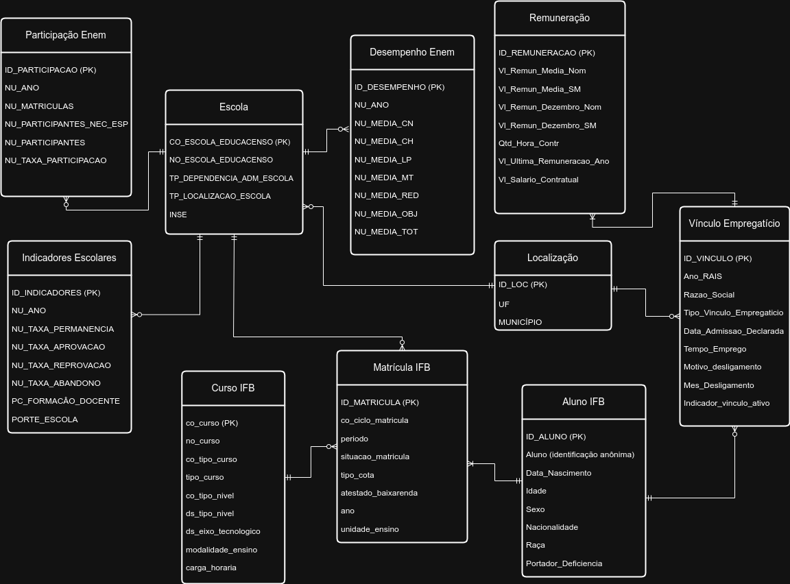
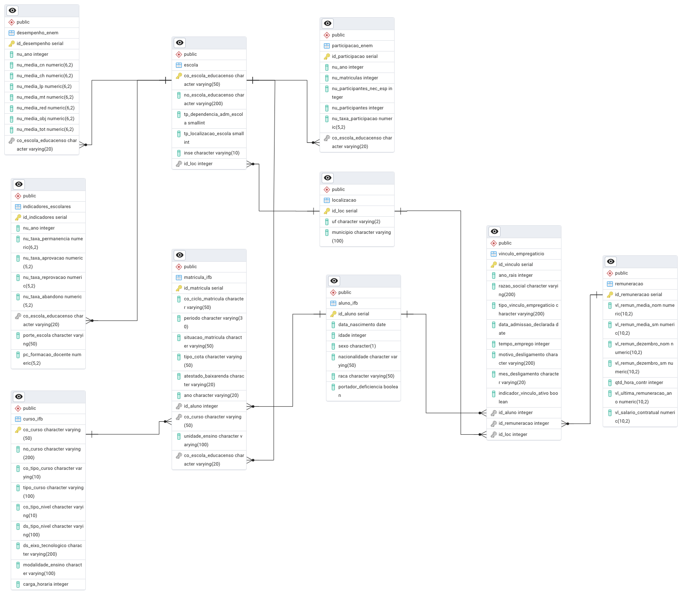

# Projeto de Banco Relacional - MC536

## Visão Geral
Alunos participantes:
- Felipe Rocha Verol (RA: 248552)
- Lucas Bellusci D'Andréa (RA: 206009)
- Theo Maceres Silva (RA: 220825)

Esse é um repositório para o primeiro projeto da disciplina MC536, que envolve projetar um banco de dados relacional, populá-lo e fazer 5 consultas não triviais, usando PostgreSQL.
Para essa tarefa, foi criado um banco de dados que busca relacionar índices escolares com o mercado de trabalho de uma região e fazer comparações de outras escolas com o Instituo Federal de Brasília.

## Datasets
Foram usados os seguintes datasets para o projeto:
- [MICRODADOS_ENEM_ESCOLA](dados/brutos/microdados_enem_por_escola.zip): relacions escolas, de diferentes locais, com seus índices escolares e desempenho no ENEM em cada participação.
- [mundo_trabalho.csv](dados/brutos/mundo_trabalho_csv.zip): contém dados de alunos e ex-alunos do Instituto Federal de Brasília sobre suas matrículas em diferentes cursos e sobre seus vínculos empregatícios.    

OBS: os datasets em formato CSV estão compactados dentro de arquivos ZIP

## Modelos Conceitual, Relacional e Físico
Aqui estão os modelos criados para o melhor entendimento de como deve ser o funcionamento do banco de dados:

### Modelo Conceitual
 

### Modelo Relacional

### Modelo Físico
O SQL do modelo físico, gerado pela ferramenta pgAdmin 4, está no reposítorio, podendo ser encontrado no diretório [modelos/modelo_fisico.sql](modelos/modelo_fisico.sql).

## Explicação das principais tabelas
- aluno_ifb: contém informações sobre um estudante do IFB, com primary key sendo id_aluno
- matricula_ifb: contém informção sobre as matrículas de um aluno, como o curso que está sendo cursado pelo aluno
- vinculo_empregaticio: contém informações sobre o emprego que um aluno do IFB tem ou teve, como a remuneração e o local do trabalho

- escola: contém informações sobre a escola, como sua localização
- indicadores_escolares: contém informações mais específicas sobre como é a escola, como taxa de abandono e taxa de reprovação
- desempenho_enem: contém informações sobre o desempenho no ENEM de uma escola em determinado ano
- participacao_enem: contém informações sobre a participação de uma escola em determinado ano, como número de participantes

  
